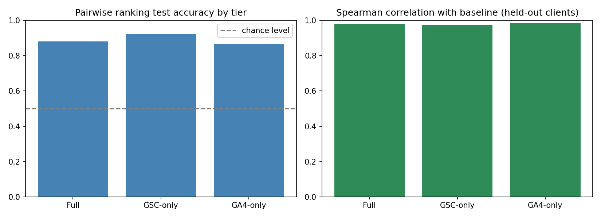
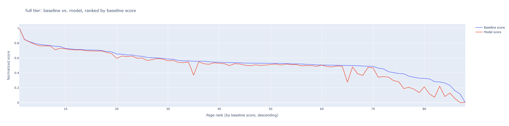
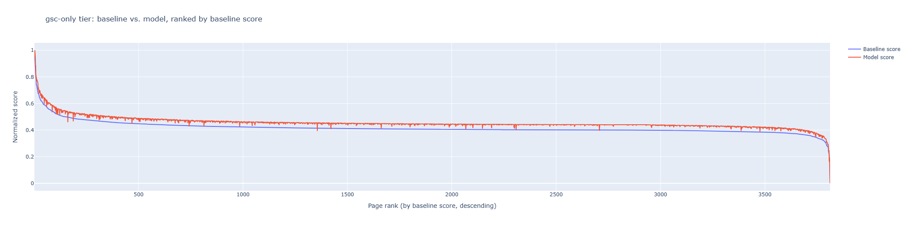
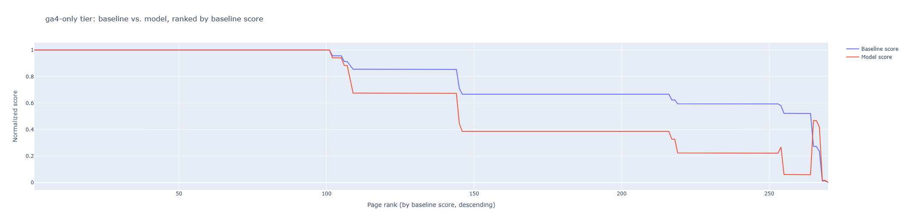

# Capstone Report — Refresh / Content Opportunity Scoring

- **Author:** Ammar
- **Lane:** Refresh / Content Opportunity Scoring (Lane 2)
- **Repo:** https://github.com/ammar-aa/Fly_rank_internship_repo.git
- **Date:** August 2026

## 1. Problem framing

Which pages in a content catalog are worth prioritizing for a refresh, and what
should an editor do first? The unit of analysis is a page (one row per
client × content pair). The output is a ranked, tier-specific priority score paired
with a plain-English reason and an action flag. The action a human takes is to open
the top-N flagged pages per tier and decide whether to refresh, deprioritize, or
leave the page as-is. The cost of a wrong call runs both ways: a false positive
wastes editor review time; a false negative leaves a genuinely declining page
unaddressed. Data helps here because manually reviewing every page in a large
catalog isn't feasible — a defensible, explainable shortlist is.

## 2. Data safety

Source: the full FlyRank internship warehouse release (Hugging Face,
`FlyRank/internship-warehouse`), specifically `fact_content_daily_performance` for
February and March 2026, aggregated to one row per page.

Deliberately excluded:
- `fact_content_query_90d` — its 90-day window is fixed to the sealed test period,
  so using it would leak that period into training.
- `dim_content`'s date columns (`content_updated_date`, `last_optimized_date`,
  `optimization_eligible_date`) — current-state snapshots as of a later export date,
  not historical values; using them risks leaking future information.
- `trend_pct` / `trend_direction` — used only to build the eligibility gate and
  label, never as a model feature. An earlier experiment (Week 3) showed that
  including a gate-derived signal as a feature inflates model performance to
  near-perfect, directly demonstrating this leak.

`client_hash_id` / `content_hash_id` are used only for grouping (train/test splits),
never as model features. No client names, domains, or private queries appear
anywhere in this work.

## 3. Baseline

A tiered, rule-based baseline: pages are routed into Full / GSC-only / GA4-only
tiers based on data availability, since each has a different set of usable signals.
Each tier has a **gate** (1-2 signals, thresholds grounded in external SEO/GA4
benchmarks where available, or fixed within-population thresholds where no clean
external benchmark applied) that defines eligibility (`needs_refresh`), and a
**baseline score** — a hand-picked, SEO-reasoned weighted formula over that tier's
remaining signals (CTR, position, engagement rate, etc.).

This is a fair comparison for the model because the model uses the exact same
scoring-signal feature sets, evaluated on the same held-out, client-grouped split,
and is asked to reproduce the same ranking the baseline produces — not an easier or
different task.

## 4. Model / analysis

A pairwise learning-to-rank approach: for pairs of pages within the same client, the
difference between their feature vectors predicts which of the two the baseline
ranked higher, via Logistic Regression. Feature sets by tier:
- **Full tier:** gsc_avg_position, ctr, gsc_clicks, ga4_engaged_sessions, scroll_rate,
  avg_engagement_sec_per_session, ga4_pageviews/ga4_users ratio
- **GSC-only tier:** gsc_sum_position, ctr, gsc_clicks
- **GA4-only tier:** ga4_engaged_sessions, ga4_users, avg_engagement_sec_per_session,
  ga4_pageviews, scroll_rate

Deliberately excluded from every tier's features: any signal used by that tier's
gate (e.g. `trend_pct`, `gsc_avg_position` for GSC-only), since those directly define
the label being predicted.

Target, in one sentence: given two pages from the same client, predict which one the
baseline formula ranked as higher refresh priority, using only that tier's scoring
signals.

## 5. Evaluation

Split: `GroupShuffleSplit` grouped by `client_hash_id` (80/20), so no client's pages
appear in both train and test — this prevents the model from learning client-specific
shortcuts rather than the general signal relationships being tested.

| Tier | Train accuracy | Test accuracy | Spearman correlation (held-out) |
|---|---|---|---|
| Full | 0.957 | 0.880 | 0.979 |
| GSC-only | 0.882 | 0.922 | 0.975 |
| GA4-only | 0.973 | 0.867 | 0.985 |

All three tiers score well above the 0.5 chance level on pairwise accuracy, and all
three show a Spearman correlation above 0.97 with the baseline's ranking on
held-out clients.

**Error analysis (GA4-only tier):** the ranked test output shows large blocks of
pages with identical feature values (0 engaged sessions, 1 session, 0 engagement
time) producing tied, uninformative rankings. This is a direct consequence of this
tier's data sparsity (median ~2 sessions per page), not a modeling failure — the
model correctly has no basis to distinguish pages whose inputs are mechanically the
same.

## 6. Interpretation

The GSC-only model's ranking is not purely position-driven: pages with notably
higher CTR and click volume are pulled down in priority relative to lower-CTR pages
at similar positions, consistent with that tier's locked scoring weight (CTR
weighted highest, on the reasoning that CTR reflects a page's own asset quality
rather than its competitive environment).

A surprise, not fully resolved: across every rebuild of the trend-severity
cross-signal table (Week 4), GA4-side engagement metrics and CTR rose with decline
severity up to "Mild decline," then dropped at "Sharp decline" — the opposite of a
single clean "worse trend, worse everything" story. A plausible but untested
explanation is that a page's search visibility and on-page engagement can move on
different timelines within the same window (a page collapsing in search may already
be recovering on the engagement side). This was not directly verified and is
reported as an open question rather than a finding.

## 7. Recommendation

The output is a ranked list of pages per tier, each with a plain-English reason
(from the gate) and specific underperforming signals (from the action logic). An
editor would use this as a periodic triage list: open the top-N flagged pages per
tier, read the reason and action text, and decide whether to refresh, deprioritize,
or leave the page as-is. This is a **decision-support tool, not an automated
action** — no content should be changed without human review.

Confidence varies by tier: Full and GSC-only tier flags are backed by richer,
more stable data and can be trusted at face value, subject to normal editorial
judgment. GA4-only tier flags should be treated with substantially less confidence —
this tier's pages typically have only 1-4 GA4 sessions for the month, so a flag
often means "insufficient data to judge," not "confirmed underperformance."

Known limits: only pages with a valid February-to-March comparison are covered
(roughly two-thirds of the catalog); the system cannot distinguish a genuine
content-quality problem from an external cause (client-side deprioritization,
seasonality, or the unresolved "remontada" pattern above).

## 8. Reproducibility

- Repo: https://github.com/ammar-aa/Fly_rank_internship_repo.git
- Notebooks: `work/notebooks/w04_baseline_score.ipynb`,
  `work/notebooks/w05_model.ipynb`, `work/notebooks/capstone.ipynb`
- Random seed: `random_state=42` used throughout (train/test splits, pair sampling)
- To re-run: clone the repo, open the notebooks in Google Colab, run top to bottom
  (each notebook handles its own Hugging Face dataset access via a read token)

---

> **Claims checklist:** all claims above use observed / measured / directional /
> decision-support language. No causal claims are made about content performance or
> about Google's ranking algorithm. No client names, domains, or private queries
> implementation approaches, and searching for external benchmarks on request.
